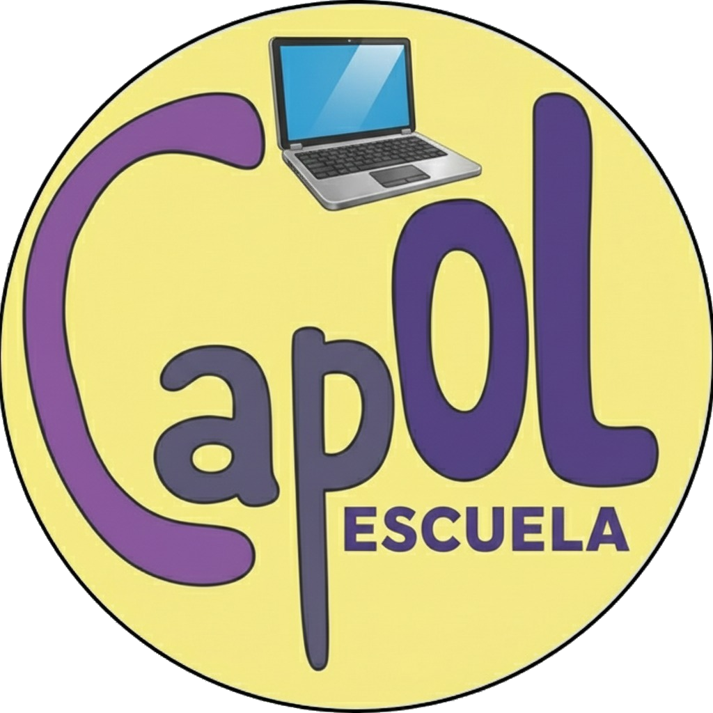
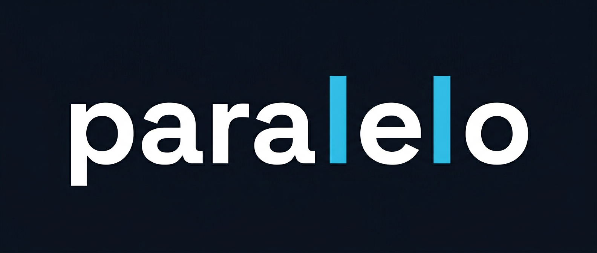

# CAPOL — Plataforma de Cursos Online

Plataforma web desarrollada para **CAPOL**, una academia de cursos online. Permite a los usuarios explorar, inscribirse y acceder a contenido educativo de forma digital.

🌐 **Demo:** [capol-escuela.netlify.app](https://capol-escuela.netlify.app/)

---

## 🛠️ Stack Tecnológico

| Tecnología | Uso |
|---|---|
| **React 18 + TypeScript** | Interfaz de usuario |
| **Vite** | Bundler y entorno de desarrollo |
| **Tailwind CSS + shadcn/ui** | Estilos y componentes |
| **Supabase** | Base de datos y autenticación |
| **TanStack Query** | Gestión del estado del servidor |
| **React Hook Form + Zod** | Formularios con validación |
| **React Router DOM v6** | Navegación |
| **Recharts** | Visualización de datos |

---

## 📁 Estructura del Proyecto

```
Capol/
├── public/         # Assets estáticos
├── src/            # Código fuente
└── supabase/       # Migraciones y configuración de base de datos
```

---

## 🤝 Desarrollado por

Desarrollado por **Paralelo** en alianza con **Apoc Automation**

<a href="https://www.paralelo.tech">
  
</a>
&nbsp;&nbsp;&nbsp;
<a href="https://apocautomation.site">
  
</a>
